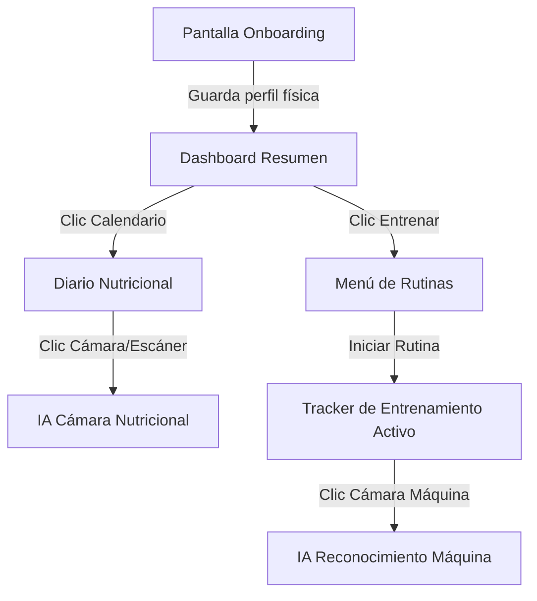

# Descripción del Proyecto: Nutri-Fit (Plan de Flujos de UI y Backend Modular)

## 0. Resumen Ejecutivo
Nutri-Fit es una aplicación de fitness de código abierto unificada (Web y Móvil). Su arquitectura de backend está estrictamente dividida en tres dominios modulares: **Nutrición**, **Entrenamiento (Trackers)** e **Inteligencia Artificial**. 

Este documento detalla la navegación del usuario (UI/UX), la interacción de clics, la transición de pantallas y cómo cada una de estas interacciones genera efectos secundarios (lecturas/escrituras) en nuestro backend modular.

---

## 1. División del Backend
Para asegurar que el sistema pueda escalar fácilmente a microservicios independientes en la nube (AWS), el backend y la base de datos están divididos lógicamente:

1. **Dominio de Nutrición (Esquema DB `nutrition`):**
   - Servicio encargado de calcular ingestas, almacenar comidas consumidas, planes semanales e interactuar con la caché de OpenFoodFacts.
2. **Dominio de Entrenamiento (Esquema DB `training`):**
   - Servicio (estilo LiftLog/Strong) para gestionar rutinas, registrar series en vivo, RPE y calcular volumen de entrenamiento.
3. **Dominio de IA (Servicio independiente `ai_service`):**
   - Microservicio contenedor en Python/FastAPI. Procesa imágenes de comida y de máquinas de gimnasio y las mapea a los otros dos servicios.

---

## 2. Flujo de Navegación (UI/UX) y Efectos en el Backend

El siguiente mapa detalla cómo las pantallas principales de la aplicación se enlazan y qué consultas/mutaciones realizan en el backend.

### 2.1. Pantalla 1: Onboarding (Cuestionario Inicial)
*   **Interfaz de Usuario (UI):**
    *   Carrusel de preguntas: Edad, Altura, Peso, Nivel de actividad, Objetivo (Bajar, Mantener, Subir) y Biotipo.
    *   Botón "Calcular y Registrar".
*   **Comportamiento en Clics (Side-Effects):**
    *   **Clic "Siguiente":** Valida los inputs localmente en Flutter.
    *   **Clic "Calcular y Registrar":** 
        *   Flutter ejecuta el algoritmo localmente para mostrar el IMC y la meta calórica.
        *   **Efecto en Backend:** Realiza una mutación `INSERT` en `public.users` y en `nutrition.user_goals` con el plan calórico inicial. Crea el perfil del usuario.

### 2.2. Pantalla 2: Dashboard Principal (Resumen Diario/Semanal)
*   **Interfaz de Usuario (UI):**
    *   Calendario semanal horizontal.
    *   Gráficos circulares de calorías consumidas vs. objetivo, y macronutrientes.
    *   Resumen del entrenamiento del día (ej. "Rutina B: Pierna - Pendiente" o "Completado").
*   **Comportamiento en Clics (Side-Effects):**
    *   **Carga de Pantalla:** 
        *   **Efecto en Backend:** `SELECT` en `nutrition.food_logs` para sumar las calorías consumidas del día seleccionado.
        *   `SELECT` en `training.workout_sessions` para ver si hay un entrenamiento completado en la fecha.
    *   **Clic en un Día del Calendario:** Actualiza el estado local y repite las consultas con la nueva fecha.

### 2.3. Pantalla 3: Diario Nutricional y Cámara IA
*   **Interfaz de Usuario (UI):**
    *   Lista de comidas dividida en Desayuno, Almuerzo, Cena y Snacks.
    *   Botón "+" en cada sección -> Abre el buscador con la opción "Tomar foto con IA" o "Escanear Código de Barras".
*   **Comportamiento en Clics (Side-Effects):**
    *   **Clic "Tomar Foto con IA":**
        *   Abre la cámara del celular. Tras capturar la imagen, Flutter la sube a Supabase Storage (bucket `food_photos`).
        *   **Efecto en Backend:** Flutter llama al endpoint `/analyze-meal` del microservicio de IA enviando el ID de la foto. El microservicio de IA procesa la imagen, estima los gramos/calorías y devuelve un borrador.
        *   El usuario confirma el borrador -> `INSERT` en `nutrition.food_logs`.

### 2.4. Pantalla 4: Menú de Rutinas y Entrenamiento Activo (LiftLog Style)
*   **Interfaz de Usuario (UI):**
    *   Catálogo de rutinas creadas y botón "Empezar Entrenamiento Vacío".
    *   Buscador de ejercicios y opción "Escanear Máquina con IA".
*   **Comportamiento en Clics (Side-Effects):**
    *   **Clic "Iniciar Rutina":**
        *   Abre la pantalla de entrenamiento activo, inicia un cronómetro interno.
        *   **Efecto en Backend:** Crea una sesión vacía en `training.workout_sessions` (`INSERT` con `started_at` y `ended_at = NULL`).
    *   **Clic "Escanear Máquina con IA":**
        *   Toma de foto a una polea o máquina -> Se envía al endpoint `/identify-machine` del microservicio de IA.
        *   **Efecto en Backend:** La IA responde identificando la máquina y enviando un listado de ejercicios recomendados. Flutter renderiza la lista y permite al usuario añadir el ejercicio seleccionado a su rutina en curso.
    *   **Marcar Set como Completado (Checkbox):**
        *   **Efecto en Backend:** Envía un `UPSERT` en `training.workout_sets` con el peso y repeticiones del set.
    *   **Clic "Finalizar Entrenamiento":**
        *   Detiene el cronómetro y guarda el estado.
        *   **Efecto en Backend:** `UPDATE` en `training.workout_sessions` para poner la fecha actual en `ended_at`.
